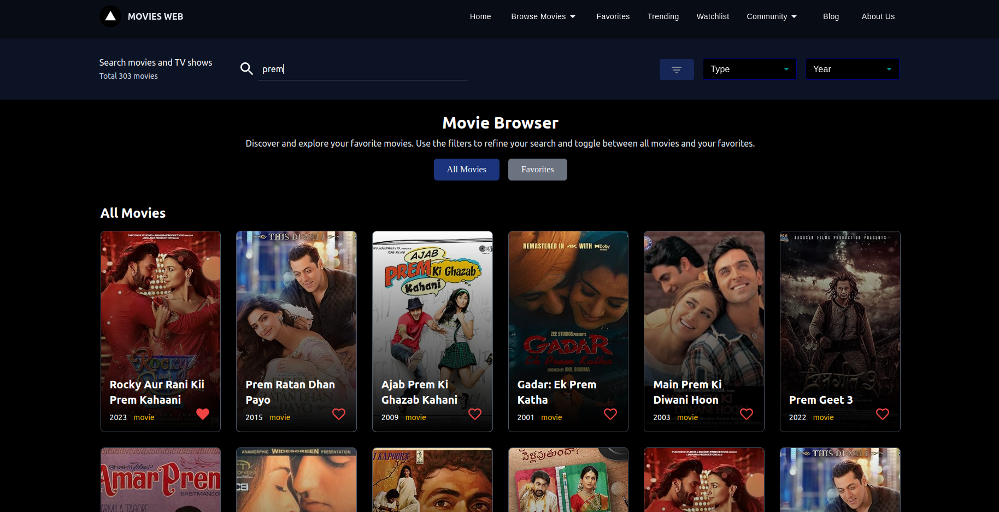

# Movie Browser Application

This is a [Next.js](https://nextjs.org/) project bootstrapped with [`create-next-app`](https://github.com/vercel/next.js/tree/canary/packages/create-next-app).

## Design Decisions

- **Next.js:** Chosen for my experience and flexibility and SSR/SSG capabilities.
- **Tailwind CSS:** For quick and responsive UI development.
- **IntersectionObserver:** For efficient infinite scrolling.
- **Local Storage:** To persist favorite movies.

## Features

- **Search Functionality:** Allows users to search for movies by title.
- **Favorite Movies:** Users can mark movies as favorites and persist this data using local storage.
- **Filtering:** Users can filter movies by type and year.
- **Infinite Scrolling:** Efficiently loads more movies as the user scrolls.

## Possible Improvements

- **UI Enhancements:** Improve the UI/UX based on user feedback.

## Getting Started

### Prerequisites

- Node.js installed on your machine
- Yarn package manager ( npm install -g yarn )

### Installation

1. Clone the repository:

   ```bash
   git clone https://github.com/Satya90jit/movies-web.git

   ```

2. Navigate to the project directory:

   ```bash
   cd movies-web

   ```

3. Install the dependencies:

   ```bash
   yarn

   ```

4. Run the development server:

   ```bash
   yarn run dev

   ```

Open [http://localhost:3000](http://localhost:3000) with your browser to see the result.

You can start editing the page by modifying `pages/index.tsx`. The page auto-updates as you edit the file.

# Demo

## Deployed URL

Check out the deployed version of this project on Vercel: https://movie-browse-web.vercel.app/

### UI/UX Responsive



## Learn More

To learn more about Next.js, take a look at the following resources:

- [Next.js Documentation](https://nextjs.org/docs) - learn about Next.js features and API.
- [Learn Next.js](https://nextjs.org/learn) - an interactive Next.js tutorial.

You can check out [the Next.js GitHub repository](https://github.com/vercel/next.js/) - your feedback and contributions are welcome!

## Deploy on Vercel

The easiest way to deploy your Next.js app is to use the [Vercel Platform](https://vercel.com/new?utm_medium=default-template&filter=next.js&utm_source=create-next-app&utm_campaign=create-next-app-readme) from the creators of Next.js.

Check out our [Next.js deployment documentation](https://nextjs.org/docs/deployment) for more details.
